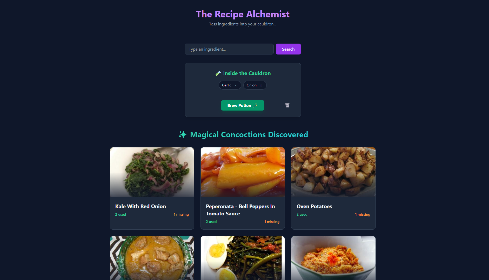

# 🧪 The Recipe Alchemist (MVP)

> "Toss ingredients into your cauldron and discover magical recipes."

 *(Adicione uma screenshot do projeto aqui depois)*

**🔗 [Live Demo: Experimente o aplicativo aqui](LINK_DO_SEU_DEPLOY_AQUI)**

## ✨ Sobre o Projeto

The Recipe Alchemist é uma aplicação web interativa que ajuda os usuários a descobrir o que cozinhar com os ingredientes que já têm em casa. Este projeto é o **MVP (Minimum Viable Product)**, focado em validar a ideia central: buscar ingredientes, gerenciar o "caldeirão" (estado global) e exibir instruções detalhadas de receitas usando dados reais.

## 🚀 Funcionalidades do MVP

- **Busca por Ingredientes:** Adicione itens da sua geladeira ao "caldeirão".
- **Integração com API Real:** Comunicação direta com a API da *Spoonacular* para buscar receitas baseadas na sua lista.
- **Gerenciamento de Estado Global:** Uso do Zustand para manter os ingredientes salvos na memória durante a navegação.
- **Livro de Feitiços (Modal):** Ao clicar em uma receita, um modal detalhado se abre mostrando a foto em alta resolução, tempo de preparo, porções, lista de medidas e o modo de preparo passo a passo.
- **Ações Rápidas:** Opção de esvaziar o caldeirão para iniciar uma nova busca rapidamente.

## 🛠️ Tecnologias Utilizadas

- **React + Vite:** Para uma interface rápida e um ambiente de desenvolvimento otimizado.
- **TypeScript:** Tipagem estática para garantir segurança e prevenir bugs na integração com a API.
- **Tailwind CSS:** Estilização responsiva, moderna e direto no HTML.
- **Zustand:** Gerenciamento de estado global leve e descomplicado.
- **Axios:** Cliente HTTP para comunicação assíncrona com a Spoonacular API.

## 📦 Como rodar localmente

1. Clone o repositório:

```bash
git clone https://github.com/SEU_USUARIO/recipe-alchemist.git
```

1. Instale as dependências:

```bash
npm install
```

1. Configure a API Key:

- Crie um arquivo `.env` na raiz do projeto.
- Adicione sua chave da Spoonacular: `VITE_SPOONACULAR_API_KEY=sua_chave_aqui`

1. Inicie o servidor de desenvolvimento:

```bash
npm run dev
```

## 🔮 Próximos Passos (Roadmap)

- [ ] Adicionar vídeos de demonstração das receitas.
- [ ] Melhorar as animações de entrada e saída dos cartões.
- [ ] Refinar a estilização UI/UX.
